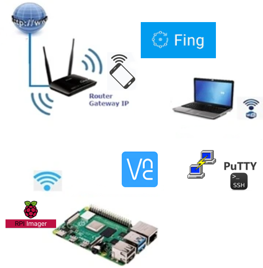

#**INSTALACIÓN de S.O. en micro SD para RPi 4B**
En los proyectos maker con la placa Raspberry Pi es interesante y cómodo controlarla de manera remota. Para prepararla se necesita un portátil, una Raspberry Pi (en este taller la RPi 4B) y su fuente de alimentación, una tarjeta micro SD, software de grabación de tarjeta RPi Imager, software de comunicaciones PuTTY (protocolo SSH) y VNC (control remoto de escritorio), una red wifi y la app Fing (buscador de IP en red local).

Recursos del taller

Fuentes de los contenidos:

[www.raspberrypi.com](https://www.raspberrypi.com/documentation/computers/getting-started.html)

[https://bricolabs.cc](https://bricolabs.cc/wiki/guias/guiadeinicioraspberrypi2021)

[https://aprendiendoarduino.wordpress.com](https://aprendiendoarduino.wordpress.com/2022/04/17/paso-a-paso-instalar-y-configurar-raspberry-pi-os)

