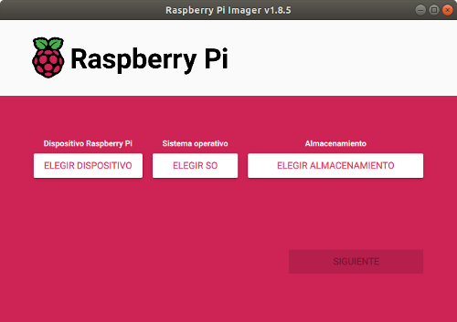
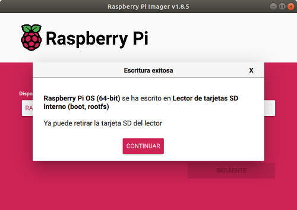

#**1. Instalación de S.O. en microSD para RPi 4B**
En los proyectos maker con la placa Raspberry Pi es interesante y cómodo controlarla de manera remota. Para prepararla se necesita un portátil, una Raspberry Pi (en este taller la RPi 4B) y su fuente de alimentación, una tarjeta microSD (16GB o más), software de grabación de tarjeta RPi Imager, software de comunicaciones PuTTY (protocolo SSH) y VNC (control remoto de escritorio), una red wifi (móvil con conexión wifi compartida) y la app Fing (opcional,buscador de IP en red local).

Recursos del taller

Fuentes de los contenidos:

[www.raspberrypi.com](https://www.raspberrypi.com/documentation/computers/getting-started.html)

[https://bricolabs.cc](https://bricolabs.cc/wiki/guias/guiadeinicioraspberrypi2021)

[https://aprendiendoarduino.wordpress.com](https://aprendiendoarduino.wordpress.com/2022/04/17/paso-a-paso-instalar-y-configurar-raspberry-pi-os)

##**1.1. Elección de la tarjeta micro SD**##
Para grabar el sistema operativo de la placa RPi la tarjeta micro SD tiene que tener una velocidad mínima de 10 Mb/seg y una capacidad de 8GB o más (los S.O. actuales neccesitan 16GB o más). Estas caracteristicas se obtiene de la serigrafía de la tarjeta como se ve en la siguiente imagen:

Características tarjeta micro SD

El sistema operativo para la placa Raspberry Pi se puede obtener en una tarjeta microSD con la aplicación NOOBS instalada (NOOBS facilita la instalación de diversas distribuciones Linux), instalando manualmente una imagen del S.O. que se descarga de la web oficial o utilizando la apliación más reciente **Raspberry Pi Imager**, fácil y cómoda de utilizar.

##**1.2. Grabación de Raspberry Pi OS con Raspberry Pi Imager**##

Para grabar **Raspberry Pi OS** en la tarjeta microSD (recomiendo una de 32GB) se descarga la apliacación [**Raspberry Pi Imager** (descargar)](https://www.raspberrypi.com/software/) para el sistema operativo de tu portátil.

[Raspberry Pi Imager v1.8.1](https://www.raspberrypi.com/software/)

Se instala en el ordenador y se arranca apareciendo una ventana como se ve en la imagen siguiente para seleccionar dispositivo, sistema operativo y tarjeta microSD, que se ha introduccido en el lector de tarjetas del ordenador.

Inicio Raspberry Pi Imager

Se seleciona la placa Raspberry Pi 4, cliqueando en la ventana emergente de **ELEGIR DISPOSITIVO**, y para seleccionar el sistema operativo (hay que dar varios pasos): cliqueando en **ELEGIR SO**-->**Raspberry Pi OS (other)**-->**Raspberry Pi OS (Legacy, 64-bit) Full**.

|            |            |
| ---------- | ---------- |
|||

Por último se cliquea en **ELEGIR ALAMCENAMIENTO** y se selecciona **Lector de tarjetas SD... 31,3GB**.

|            |            |
| ---------- | ---------- |
|||

Se activa la opción **SIGUIENTE** y se cliquea para continuar.

En este paso se va a **EDITAR AJUSTES** para personalizar el **usuario** y **contraseña** de la placa Raspberry Pi. También **Configurar LAN inalámbrica** que se crea con la conexión compartida del teléfono móvil y **Establecer ajustes regionales**.

|            |            |
| ---------- | ---------- |
|||

Por último se cliquea en la opción **SERVICIOS** para activar el protocolo de comunicaciones por consola SSH y se pulsar **GUARDAR**.

Ya se está preparado para grabar el S.O. en la tarjeta microSD pulsando la opción **SI**...

y se espera a que termine...

YA SE TIENE LO NECESARIO PARA IR AL TALLER!!!

